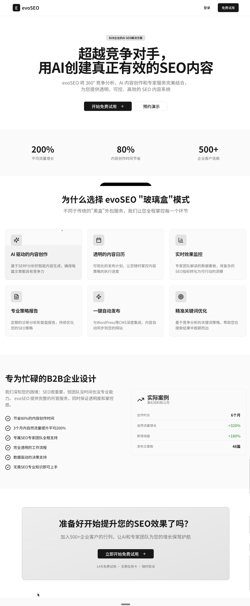
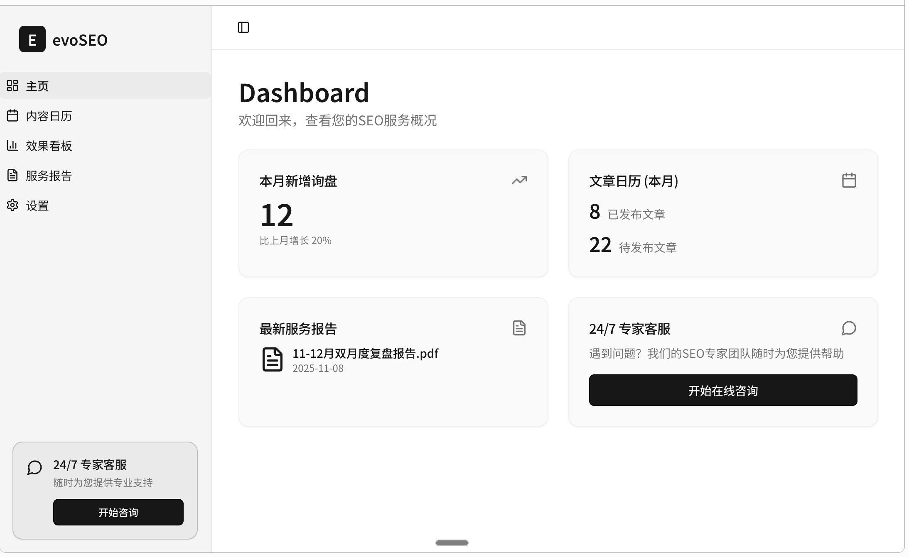
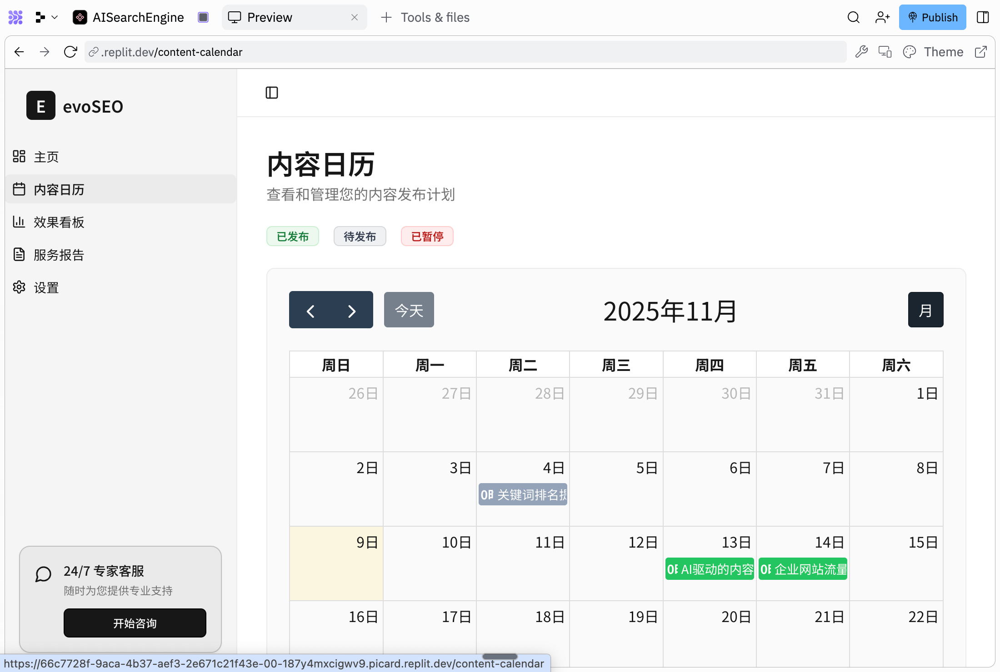
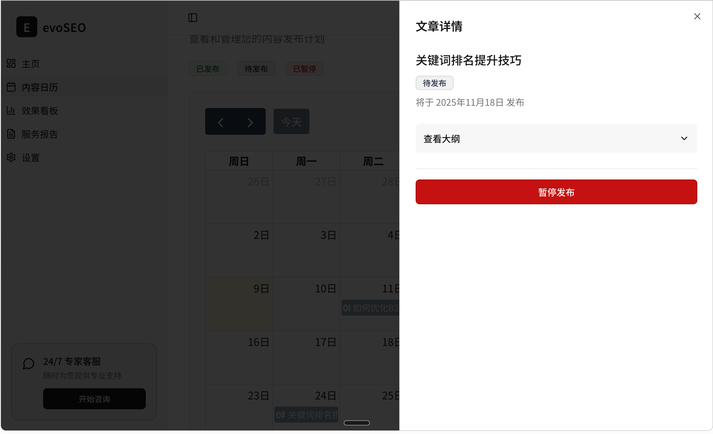
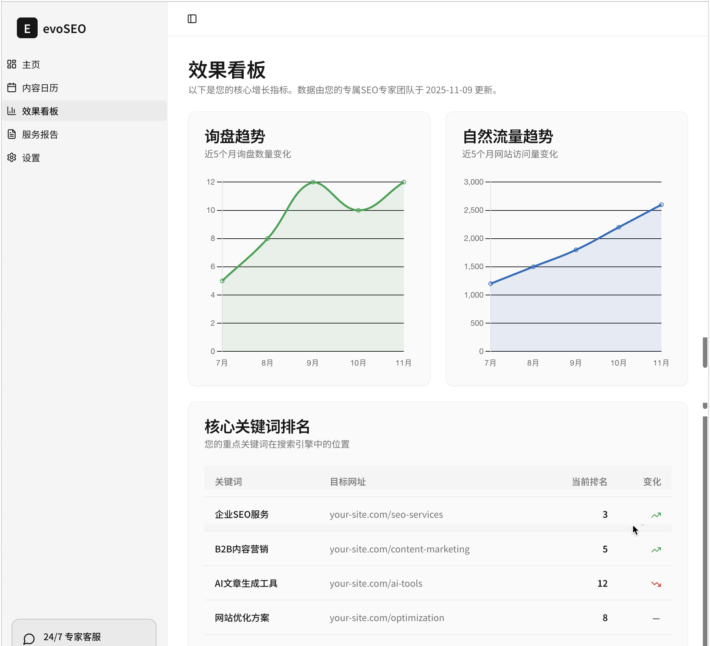
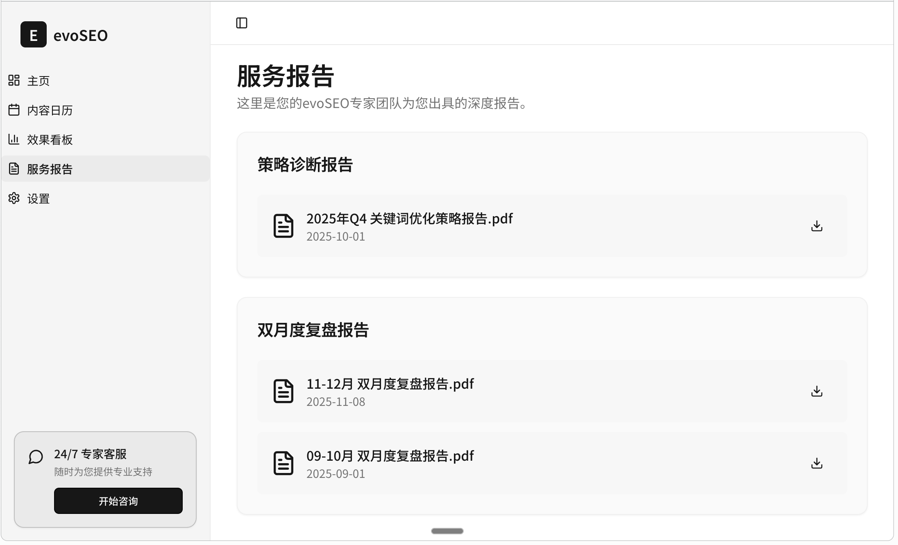
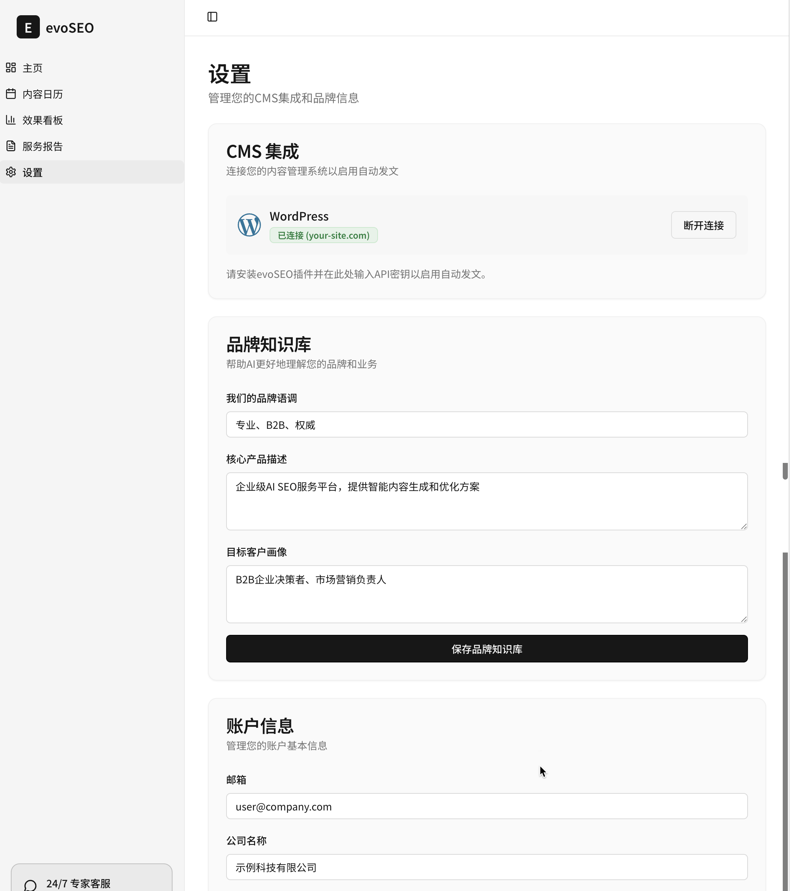

# 产品定位
evoSEO 是一个为 老板 设计的 AI SEO 助手，帮助其自动生成内容、发布内容、跟踪收录、监控流量与询盘，实现“无需懂 SEO，也能获得海外询盘”。

这个网站重点体现了与客户（老板）之间的交互，而我们内部的SEO自动化策略目前不对外暴露。 设计的原则是希望客户可以清晰地了解我们创造的价值。包括呈现其中的一些核心节点，感知到这笔钱花得有价值。 

# 功能点
## 首页

evo 的首页，展示一些内容介绍，页面如图所示，
数据通过 supabase 数据库获取，需要实现接口及调用

主要功能有 登录，用户可以通过以下方式登录
1、通过输入名称、邮箱、密码
2、google 直接授权登录

登录信息存入 supabase 的数据库里，具体定义的表可以列出来

## Dashboard
登录成功进入 当前页面，页面有侧边栏，每一项为不同页面
### 主页

页面如图所示，数据通过 supabase 数据库获取，请帮我定义数据表

### 内容日历

By 天展示每天的文章，默认月维度。可以选月/年两个维度
客户点击文章，可以展示文章全文。 
文章状态机：待发布、已发布、已暂停（暂可以没有）
   日历生成流程 ：
  1. （人工）每个月20号生成，下个月的1-30号的文章标题和文章。
  2. （人工）根据当月爆款调整，25号中午12点发布到平台，状态全部为“待发布”
  3.  每天零点自动化发布到平台，状态变为已发布。 人工生成文章，上传文章。
    1. 需要一个上传列表，可以按照日期上传
    2. 支持对应的文章上传后的内容预览，点击可打开预览页面。
    3. 页面上不可编辑，可关闭预览回到日历页。

点击日历的每一天 会打开如下的文章详情浮层，可以进行操作，查看详情，暂停发布等

### 效果看板

数据通过 supabase 数据库获取，请帮我定义数据表

询盘趋势：近6个月（默认展示）、近1年
数据源：每月询盘统计曲线
自然流量趋势：gsc流量确认
核心关键词排名 ：反馈作用最高的核心词，取前10，展示“关键词”、“目标网址”、“排名”和“变化”。 

### 服务报告

数据通过 supabase 数据库获取，请帮我定义数据表

服务报告分为两类。一类是策略诊断报告。
一类是双月复盘报告。均为人工生成支持下载。
 按时间倒序展示，把最新的放在前面。 
服务报告仅展示，提供 pdf 下载功能

需要再提供一个管理员专用的页面，提供上传文件功能

### 设置

wordPress 集成, 集成后用于定时任务发布每天的文章

### 其他
24/7专家客户
放个人微信，不用在线支持
